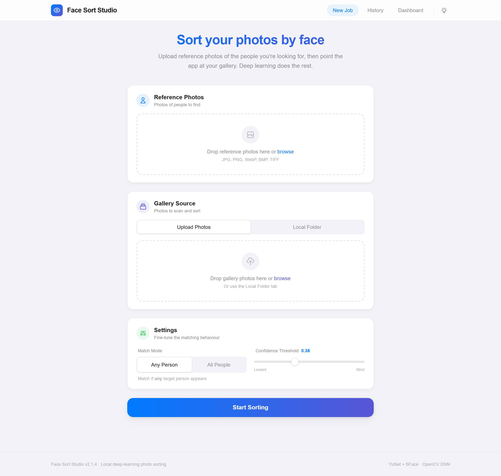
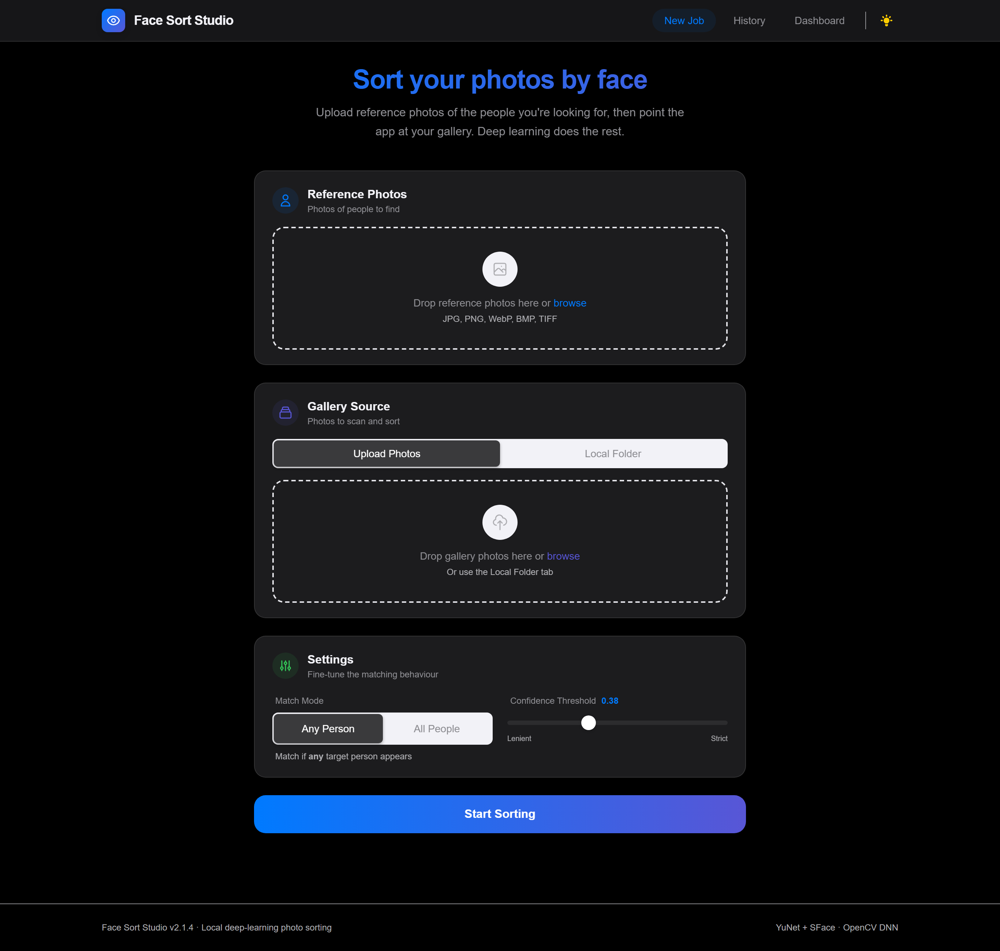
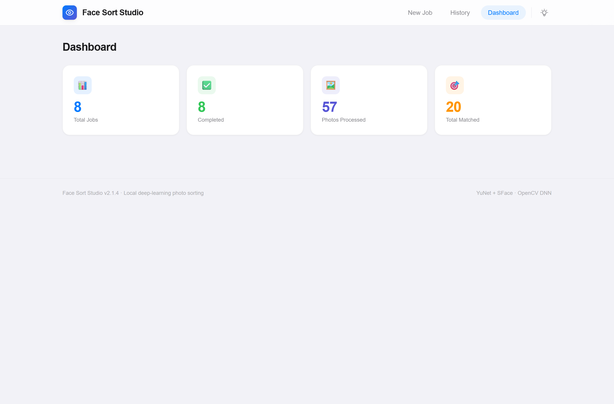

# Face Sort Studio v2.1.5

[](https://github.com/sponsors/Shaan-alpha)

**Local deep-learning photo organization — powered by face recognition.**

<p align="center">
  
</p>
<p align="center">
  
  
  <br />
  <em>Polished, fully offline browser UI — with a built-in dark mode and an analytics dashboard.</em>
</p>

Face Sort Studio is a privacy-first tool that scans your photo gallery and automatically organizes images into folders based on the people in them. Using high-performance deep learning models, it detects every face and creates unique identity embeddings to match targets with precision—all while remaining 100% offline.

Everything runs locally on your hardware. No cloud uploads, no API keys, and no data leaves your machine.

---

## ⬇️ Download (Windows)

**[Download FaceSortStudio.exe →](https://github.com/Shaan-alpha/face-sort-studio/releases/latest)**

Portable — no Python, no install. Download, double-click, and the app opens in your browser.

> First launch downloads ~37 MB of AI models (a one-time step). After that, everything runs **100% offline**.

Prefer to run from source or build the EXE yourself? See [Quick Start](#-quick-start-local-setup) and [Standalone EXE](#-standalone-exe-portable) below.

---

## What It Does

1. You upload **reference photos** containing the people you want to find.
2. You provide a **gallery** — either by uploading photos or pointing to a local folder.
3. The app detects every face, creates identity embeddings, and compares them.
4. Photos are automatically sorted into folders:

| Folder | Contents |
|---|---|
| `matched/` | Photos where the target people appear (based on your chosen mode) |
| `partial/` | Photos where some but not all targets appear (All mode only) |
| `unmatched/` | Photos with no target matches |
| `by_target/` | Sub-folders per person — each person gets their own folder |
| `targets/` | Cropped reference face thumbnails |
| `*.zip` | Compressed archives of each category for easy download |
| `report.json` | Full machine-readable results |

---

## 🔒 Privacy & Security

- **100% Offline**: No data ever leaves your machine. All processing happens locally on your hardware.
- **No Cloud Dependency**: No external APIs (Azure, AWS, Google Cloud) are used for face analysis.
- **Secure Persistence**: Results and identity embeddings are stored in a local SQLite database.
- **Zero Tracking**: The application does not include telemetry or usage tracking.

---

## Tech Stack

| Layer | Technology |
|---|---|
| Backend | **Flask** (Python) |
| Frontend | **HTML + Tailwind CSS + Vanilla JavaScript** |
| Deep Learning | **OpenCV DNN** — YuNet face detector + SFace face recognizer |
| Database | **SQLite** via SQLAlchemy |
| Real-time Updates | **Server-Sent Events (SSE)** |
| Automation | PowerShell scripts + VS Code tasks |

*   **Portable EXE**: Build a standalone Windows executable for easy distribution.

---

## 📦 Standalone EXE (Portable)
The easiest way to run the app without installing Python or any libraries is to **[download the pre-built `FaceSortStudio.exe`](https://github.com/Shaan-alpha/face-sort-studio/releases/latest)** from the latest release.

Prefer to build it yourself?
1.  Run `.\scripts\build.ps1` in PowerShell.
2.  Find **`FaceSortStudio.exe`** in the `dist/` folder.
3.  You can move this EXE anywhere—it's self-contained!

---

## 🚀 Quick Start (Local Setup)

**Windows, in three steps** (full setup options are in [Setup](#setup) below):

```powershell
git clone https://github.com/Shaan-alpha/face-sort-studio.git
cd face-sort-studio
powershell -ExecutionPolicy Bypass -File .\scripts\setup.ps1   # creates a venv + downloads models
powershell -ExecutionPolicy Bypass -File .\scripts\run.ps1     # starts the app + opens your browser
```

> **First run downloads ~37 MB of AI models** (a one-time step). After that, everything runs fully offline.

**macOS / Linux:** the Flask core is pure Python — see the cross-platform steps in [Setup → Option C](#setup).

---

## Project Structure

```
face-sort-studio/
│
├── run.py                          # Entry point — starts Flask
├── requirements.txt                # Python dependencies
│
├── face_sort/
│   └── app/
│       ├── main.py                 # Flask app factory + all routes
│       ├── config.py               # Paths, thresholds, tunables
│       ├── database.py             # SQLAlchemy models (Job, JobResult, TargetFace)
│       ├── bootstrap.py            # Auto-downloads DL models if missing
│       │
│       ├── services/
│       │   ├── face_engine.py      # Face detection + recognition wrapper
│       │   └── job_runner.py       # Orchestrates a sorting run end-to-end
│       │
│       ├── templates/
│       │   └── index.html          # Single-page UI (Jinja + Tailwind)
│       │
│       └── static/
│           ├── css/styles.css      # Apple-inspired design system
│           └── js/app.js           # Frontend logic (uploads, SSE, tabs)
│
├── scripts/
│   ├── setup.ps1                   # One-click environment setup
│   ├── run.ps1                     # One-click server start
│   └── share-with-tailscale.ps1    # Start app + open Tailscale Funnel
│
├── tests/
│   └── test_app.py                 # Smoke tests
│
├── data/                           # Created at runtime
│   ├── database/                   # SQLite file
│   ├── models/                     # ONNX model files
│   ├── jobs/                       # Temporary upload storage
│   └── outputs/                    # Sorted results per job
│
└── .vscode/
    ├── tasks.json                  # Setup / Run / Test tasks
    └── launch.json                 # Debug profile
```

---

## GitHub Pages

GitHub Pages can publish the static site in `docs/`, but it **cannot** run the Flask API, SQLite database, Server-Sent Events stream, or OpenCV face-sorting pipeline.

Use GitHub Pages for:

- a project landing page
- setup and usage documentation
- screenshots, demos, and repository links

Use a Python-capable environment for:

- the actual sorting application
- file uploads and local folder access
- model downloads and face matching jobs

To publish the static site:

1. Push this repository to GitHub.
2. In **Settings > Pages**, choose **Deploy from a branch**.
3. Select your branch and the `/docs` folder.
4. Save, then wait for GitHub Pages to publish the site.

## Free Full-App Deployment

For the actual Flask + OpenCV app, the best fully free setup is to run it on your own machine and share it with Tailscale.

See [docs/DEPLOY_FREE.md](docs/DEPLOY_FREE.md) for:

- the safest GitHub setup for this project folder
- a one-command Tailscale sharing flow
- the shared-mode limitation around local folder paths

---

## How Face Matching Works

The pipeline runs in five stages:

### Stage 1 — Face Detection (YuNet)

Every image is passed through the **YuNet** deep neural network. YuNet is a lightweight face detector that outputs bounding boxes and facial landmarks. It handles multiple faces per image and works at various scales.

### Stage 2 — Face Embedding (SFace)

Each detected face is aligned using the landmarks and then passed through the **SFace** network. SFace produces a 128-dimensional normalised vector (an "embedding") that uniquely represents a person's face. Two embeddings of the same person will be close together in this vector space; two different people will be far apart.

### Stage 3 — Target Clustering

All faces found in the reference photos are clustered by similarity. If you upload three photos of the same person, the app recognises them as one target (not three). This gives you a clean list of distinct people to search for.

### Stage 4 — Gallery Scanning

Each gallery image is scanned. Every face found is compared against all target embeddings using **cosine similarity**. If the score exceeds your threshold, it is a match.

### Stage 5 — Sorting

Based on your match mode:

- **Any mode** — a photo is "matched" if **any** target person appears in it.
- **All mode** — a photo is "matched" only if **every** target person appears. Photos with some (but not all) targets go into "partial".

Photos are copied (never moved) into the output folders.

---

## Prerequisites

- **Python 3.11+** — [python.org](https://python.org/downloads)
- **Primary support: Windows** — the automation scripts and portable EXE are Windows-only. The Flask core is pure Python and runs on macOS/Linux via the manual steps ([Option C](#setup)); the system-tray + auto-open-browser launcher (`run.py`) is a Windows-desktop convenience, while `face-sort` is the cross-platform headless command.
- **Tailscale** (optional) — only needed for the public sharing flow

---

## Setup

### Option A — VS Code (Recommended)

1. Open the project folder in VS Code.
2. Press `Ctrl+Shift+P` → **Tasks: Run Task** → **Face Sort Studio: Setup**
3. Wait for setup to finish.
4. Run task: **Face Sort Studio: Run**
5. Open the URL printed in the terminal.

### Option B — PowerShell

```powershell
cd face-sort-studio
powershell -ExecutionPolicy Bypass -File .\scripts\setup.ps1
powershell -ExecutionPolicy Bypass -File .\scripts\run.ps1
```

### Option C — Manual

```bash
# 1. Create and activate virtual environment
python -m venv venv
# Windows:
.\venv\Scripts\activate
# macOS/Linux:
source venv/bin/activate

# 2. Install dependencies
pip install -e .

# 3. Create data directories
python -c "from pathlib import Path; [Path(p).mkdir(parents=True, exist_ok=True) for p in ('data/database', 'data/jobs', 'data/outputs', 'data/models')]"

# 4. Run the app
face-sort
```

Then open the URL printed by Flask.

---

## Usage

### Step 1 — Add Reference Photos

Click or drag-and-drop one or more photos of the people you want to find. These can contain one face or many — the app detects and clusters all faces automatically.

### Step 2 — Provide Gallery

Choose one of two methods:

- **Upload Photos** — drag-and-drop or select gallery images directly in the browser.
- **Local Folder** — paste the absolute path to a folder on your computer (e.g. `C:\Users\You\Pictures\Vacation`).

### Step 3 — Configure Settings

- **Match Mode**
  - `Any Person` — photo matches if at least one target appears.
  - `All People` — photo matches only if every target appears.
- **Confidence Threshold** (0.20 – 0.70)
  - Higher = stricter matching (fewer false positives, may miss some real matches).
  - Lower = more permissive (catches more real matches, may include some false positives).
  - Default `0.38` works well for most cases.

### Step 4 — Start Sorting

Click **Start Sorting**. The progress panel shows real-time updates via Server-Sent Events. You can see each image being processed and classified.

### Step 5 — View Results

When complete, the results panel shows match/partial/unmatched counts. Output files are in:

```
data/outputs/<job-id>/
├── matched/
├── matched.zip                     # Compressed matched results
├── partial/
├── partial.zip                     # Compressed partial results
├── unmatched/
├── unmatched.zip                   # Compressed unmatched results
├── by_target/
│   ├── Person_01/
│   └── Person_02/
├── targets/
└── report.json
```

---

## API Reference

When the Flask backend is running, these endpoints are available:

| Method | Endpoint | Description |
|---|---|---|
| `GET` | `/` | Serves the web UI |
| `POST` | `/api/jobs` | Create a new sorting job (multipart form) |
| `GET` | `/api/jobs` | List all jobs (newest first, max 50) |
| `GET` | `/api/jobs/<id>` | Get status and stats for one job |
| `GET` | `/api/jobs/<id>/stream` | SSE stream of real-time progress |
| `GET` | `/api/jobs/<id>/report` | Download the full JSON report |
| `DELETE` | `/api/jobs/<id>` | Delete a job and its files |
| `GET` | `/api/analytics` | Dashboard summary statistics |

### Creating a Job (POST /api/jobs)

Form fields:

| Field | Type | Required | Description |
|---|---|---|---|
| `references` | File(s) | Yes | One or more reference photos |
| `gallery` | File(s) | If no path | Gallery photos to upload |
| `gallery_path` | String | If no files | Absolute path to a local folder |
| `match_mode` | String | No | `any` (default) or `all` |
| `threshold` | Float | No | `0.38` (default), range 0.20–0.70 |

---

## Database

SQLite database at `data/database/face_sort_studio.db`.

Three tables:

- **jobs** — one row per sorting run (status, settings, stats, timestamps)
- **job_results** — one row per gallery image (category, faces detected, matched targets)
- **target_faces** — one row per discovered target person (label, source file, embedding hash)

The schema is managed by SQLAlchemy and auto-created on first run.

---

## Testing

```bash
python -m pytest tests/ -v
```

Tests cover: route availability, empty-state responses, config validation, and import checks.

---

## Tips for Best Results

- **Clear, front-facing photos** work best as references.
- Avoid very small, blurry, dark, or extreme-angle faces in references.
- If you get too many false matches → **raise** the threshold.
- If the app misses real matches → **lower** the threshold slightly.
- **All mode** is intentionally stricter — use it when you need group photos with everyone present.
- One good reference photo per person is usually enough; more help in marginal cases.

---

## Supported Image Formats

`.jpg` · `.jpeg` · `.png` · `.bmp` · `.webp` · `.tif` · `.tiff`

---

## Upgrade Roadmap

These are planned or suggested improvements for future versions:

### Near-Term
- **Person renaming** — rename "Person_01" to actual names in the UI
- **Face bounding box preview** — overlay detected faces on image thumbnails
- **Batch operations** — re-run a previous job with different settings

### Medium-Term
- **TensorFlow integration** — swap OpenCV models for TensorFlow-based detection/recognition for improved accuracy on challenging photos
- **Azure Blob Storage** — optionally store outputs in Azure instead of local disk
- **Azure SQL Database** — swap SQLite for Azure SQL for multi-user deployments
- **Power BI connector** — export analytics data for Power BI dashboards
- **WebSocket progress** — replace SSE with WebSockets for bidirectional communication

### Long-Term
- **GPU acceleration** — CUDA/DirectML support for faster processing of large galleries
- **Multi-user mode** — authentication and per-user job isolation
- **REST API auth** — API key or OAuth for programmatic access
- **Docker container** — one-command deployment
- **Electron wrapper** — native desktop app packaging

---

## Architecture Decisions

**Why Flask instead of FastAPI?**
Flask's synchronous model is simpler to reason about for a local desktop-style app. Background jobs run in threads. The template engine (Jinja2) is built in. For a single-user local tool, Flask is the right balance of simplicity and power.

**Why OpenCV DNN instead of TensorFlow?**
The OpenCV models (YuNet + SFace) are compact ONNX files (~37 MB total, downloaded once on first run) that run on CPU without CUDA. They provide excellent accuracy for face detection and recognition. TensorFlow integration is on the roadmap for users who want to push accuracy further on difficult photos.

**Why SQLite?**
Zero configuration, no separate database server, single file. Perfect for a local app. The SQLAlchemy ORM means swapping to PostgreSQL or Azure SQL later requires only changing the connection string in `config.py`.

**Why SSE instead of WebSockets?**
Server-Sent Events are simpler (one-directional: server → client), work over standard HTTP, and are all that is needed for progress streaming. The browser's `EventSource` API handles reconnection automatically.

---

## ⭐ Star History & Community

We welcome contributions, bug reports, and feature requests! Check out our new interactive issue forms if you have ideas for new clustering algorithms or export formats. If you find Face Sort Studio helpful, consider giving it a star or sponsoring the project!

[](https://star-history.com/#Shaan-alpha/Face-Sort-Studio&Date)

---

## License

MIT — see [LICENSE](LICENSE).
